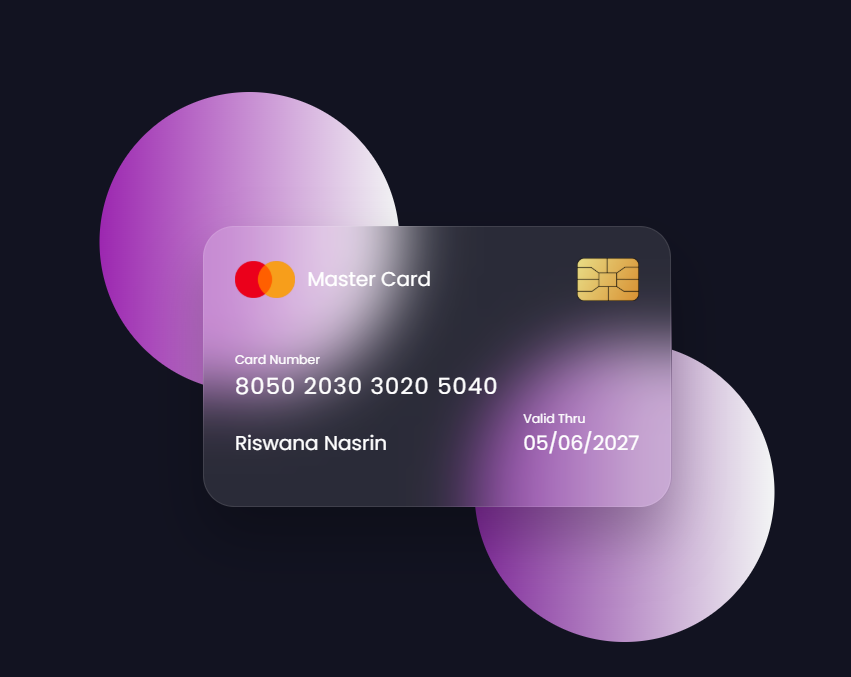

# 💳 Credit Card Flip Animation (MasterCard Style)

A sleek and interactive credit card flip animation built with **HTML** and **CSS**. The card flips on hover to reveal the back side, mimicking the look and feel of a real **MasterCard** or debit/credit card.

## 🔗 Live Demo

👉 [View Live on GitHub Pages](http://127.0.0.1:5500/flipcard/flip.html)  

## 🖼️ Preview

  

## 🛠️ Built With

- HTML5
- CSS3 (3D Transforms & Transitions)

## 🎯 Features

- Realistic credit card design (front and back)
- Smooth 3D flip on hover
- Responsive layout (optional to add)
- Customizable content (name, card number, CVV, etc.)
